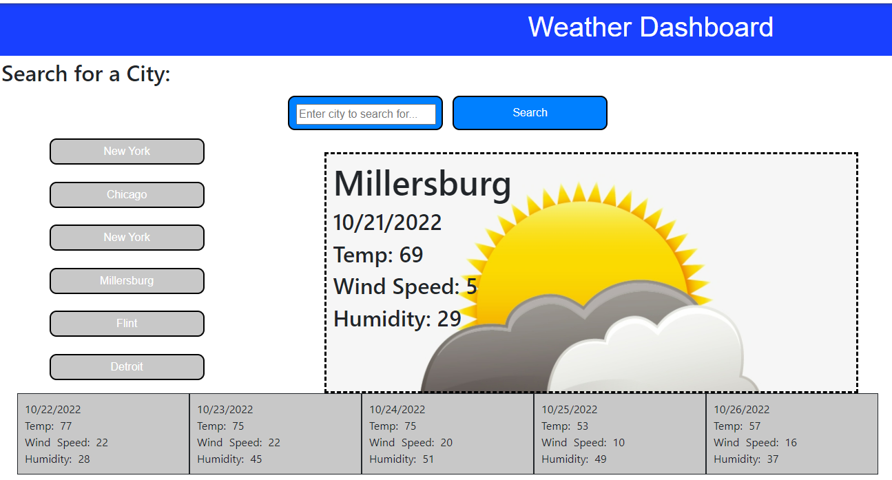

# 06: Weather Dashboard

## Description

This project demonstrates automation that can be used to check the weather using OpenWeatherAPI.  The user has the abilty to search for cities and check the weather.  Upon refresh, the cities that the user has previously searched for will be displayed in buttons along the left.

### Technologies Used

* HTML
* JavaScript
* CSS
* OpenWeather API

### Screenshot

https://bussudo.github.io/weatherdashboard/
